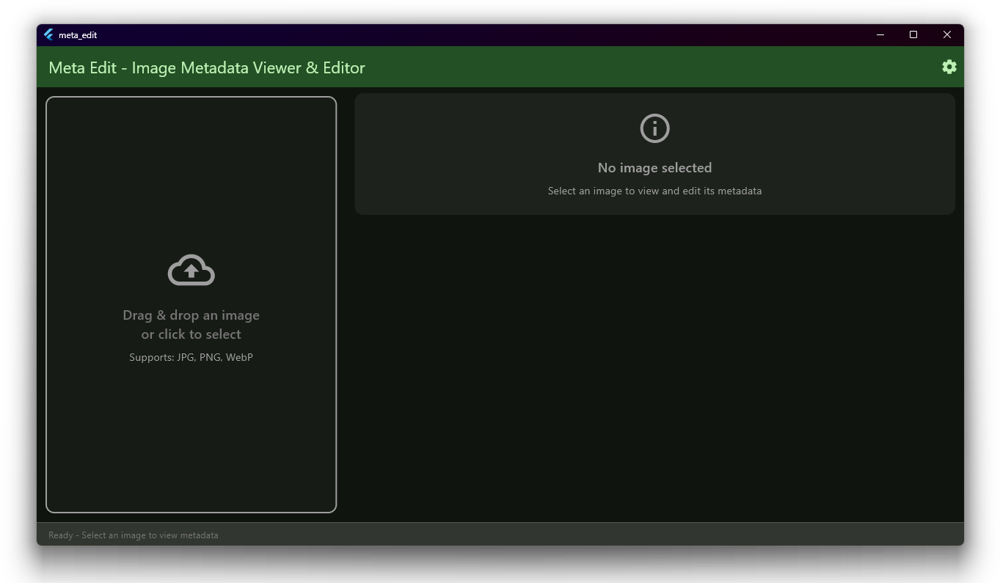
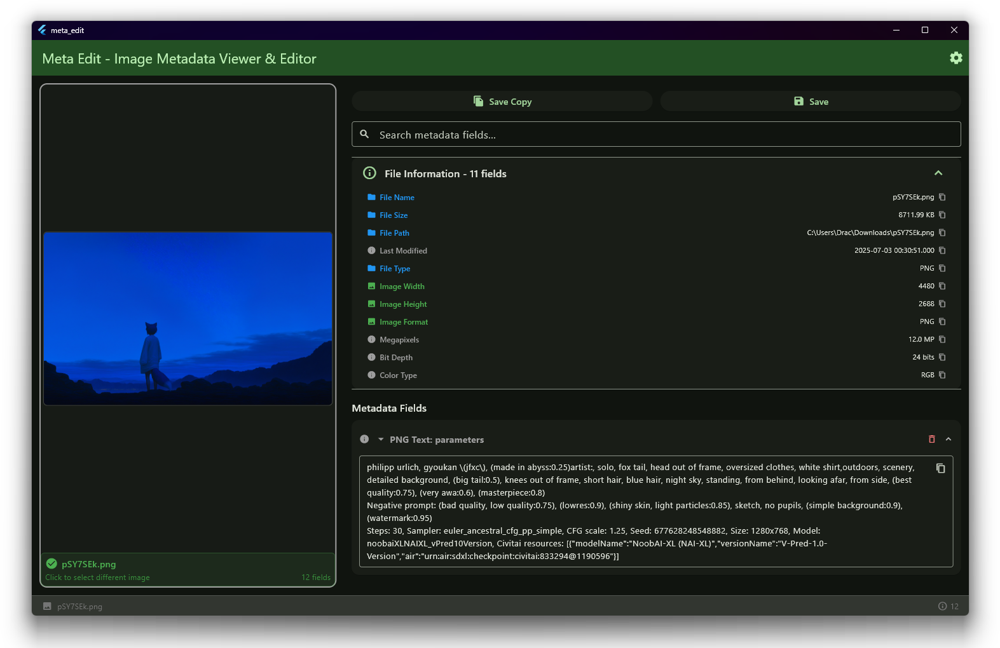
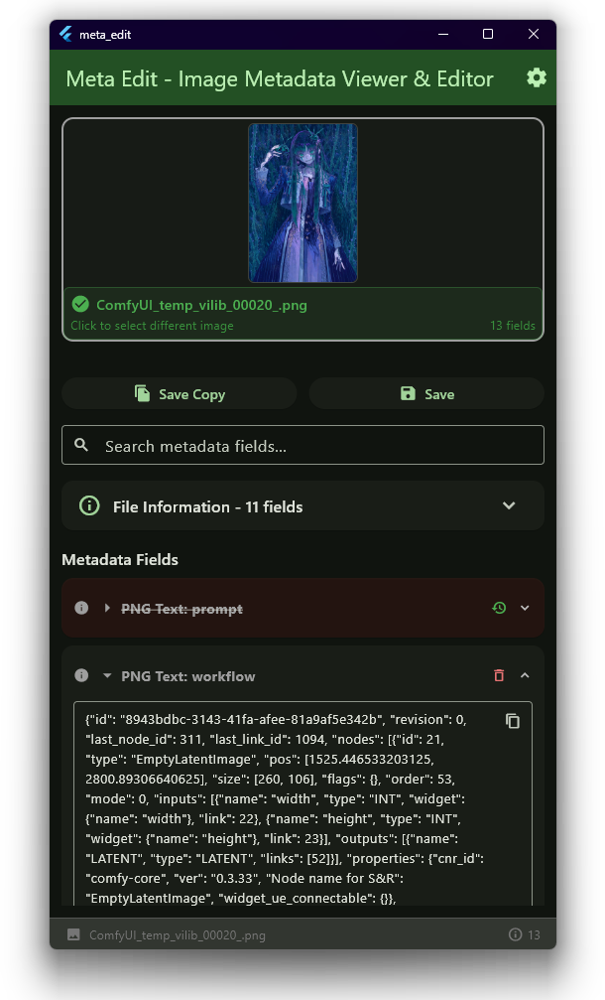

# Meta Edit - Image Metadata Viewer & Editor

I wanted a general metadata viewer mainly for PNGs so i can copy the metadata from ai generated images since most other programs i found didnt fit my preferences or just couldnt read (or rather display) certain metadata (like comfyui workflow), like sd prompt reader.  
My preferences also required the app to look nice, not be 100-200mb in size and be an actual executable (and not just a script, because i like GUIs), so i chose flutter.  
Note: This program just happens to be able to edit and save the modified metadata fields, its more of a byproduct because i couldnt resist asking ai to just add it for me. Only tested PNG but hopefully jpeg and webp work fine too.
maybe conversion support soon:tm: since i dabbled into that in python before but dart seems to be too much effort for this.

technically runs on web but untested except png a bit, is laggy kinda, maybe github actions + pages build soon

showcase or something, works the same on linux

